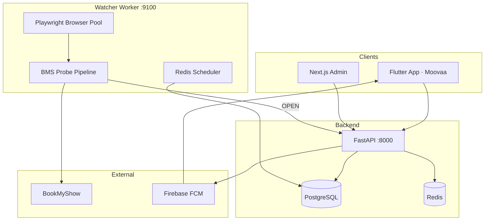
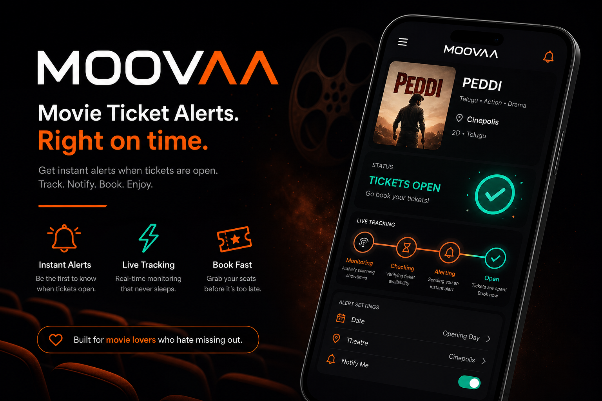
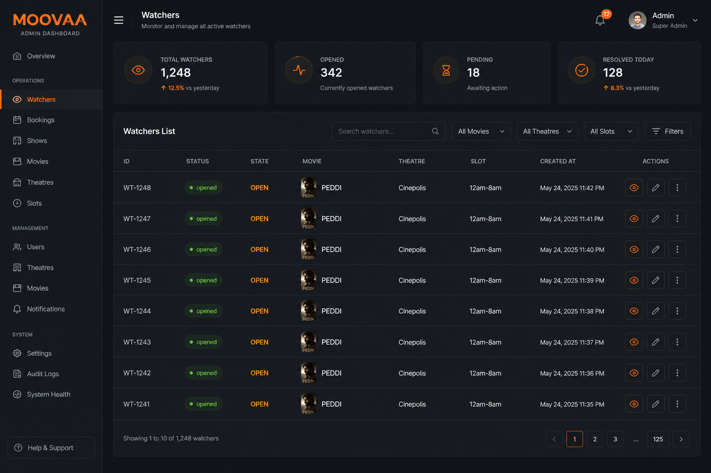

<p align="center">
  
</p>

<h1 align="center">MOOVAA</h1>

<p align="center">
  <strong>Never miss FDFS again.</strong><br/>
  Real-time BookMyShow ticket alerts for theatre-specific First Day First Show openings in India.
</p>

<p align="center">
  <a href="#project-overview">Overview</a> •
  <a href="#tech-stack">Tech Stack</a> •
  <a href="#architecture">Architecture</a> •
  <a href="#features">Features</a> •
  <a href="#screenshots">Screenshots</a>
</p>

---

## Project Overview

**MOOVAA** is a full-stack **ticket-alert platform** for Indian cinema fans. Users pick a **movie**, **city**, **theatre**, **show date**, **language**, and **time window** (e.g. 12am–8am FDFS). The system monitors **BookMyShow** in the background and sends a **push notification** the moment a matching showtime becomes bookable.

Unlike generic “movie is live” apps, MOOVAA tracks **your exact theatre and slot** — so you only get alerted when *your* show is available.

**How it works:**

```
Movie → Theatre → Language → Time slot → Alert → Push → Book on BMS
```

**Repository layout:**

| Path | Purpose |
|------|---------|
| `moovaa/` | Flutter consumer app (Android, iOS, Web) |
| `backend/` | FastAPI REST API, FCM, catalog, alerts |
| `watcher/` | Playwright monitoring worker + BMS probe pipeline |
| `admin/` | Next.js operations dashboard |
| `bms-clone/` | Local BookMyShow clone for dev & integration tests |
| `testing/` | Synthetic pages, regression, chaos, soak tests |
| `deploy/` | Docker, systemd, Nginx, dev scripts |

---

## Tech Stack

| Layer | Technologies |
|-------|----------------|
| **Mobile** | Flutter 3, Dart, Riverpod, GoRouter, Dio, Firebase Auth & FCM |
| **API** | Python 3.11, FastAPI, SQLAlchemy 2 (async), Alembic, Pydantic, JWT |
| **Data** | PostgreSQL, Redis |
| **Worker** | Playwright, structlog, Redis scheduler, staged DOM/API detection |
| **Admin** | Next.js 15, React 19, TypeScript |
| **Notifications** | Firebase Cloud Messaging, idempotent delivery logs |
| **Testing** | pytest, synthetic BMS fixtures, worker integration tests |
| **DevOps** | Docker Compose, PowerShell dev stack, systemd + Nginx configs |

---

## Architecture

MOOVAA uses a **publish–subscribe watcher model**: one **Watcher** row per unique `(movie, city, theatre, date, language, time_slot)` is polled by the worker; many **Subscriptions** (users/devices) attach to it. This deduplicates Playwright work at scale.



### BMS probe pipeline (staged checks)

Each poll runs through ordered stages until success or the next scheduled check:

| Stage | Detector state | Meaning |
|-------|----------------|---------|
| 1 | `NOT_OPEN` | Bookings not open yet |
| 2 | `WAITING_THEATRE` | Bookings open; theatre/language not matched |
| 3 | `WAITING_SLOT` | Theatre matched; no show in your time window |
| 4 | `OPEN` | Slot found → notify subscribers |
| — | `ERROR` | Fetch/parse failure (backoff + retry) |

When `OPEN` is detected, the watcher status becomes **`opened`**, FCM pushes fire, and polling winds down.

---

## Features

### Consumer app (`moovaa/`)
- Onboarding, home, movie catalog, theatre picker with language selection
- Create alerts for specific date + time slot (12am–8am, 8am–4pm, etc.)
- **Live tracking** screen with delivery-style pipeline (bookings → theatre → slot → notify)
- Real-time countdown to next worker poll + exact last-check timestamps
- FCM push notifications with deep links to BookMyShow booking URLs
- In-app notification inbox, watchlist, profile & preferences

### Backend API (`backend/`)
- Device registration + JWT auth
- Alert CRUD with watcher deduplication (`UNIQUE` constraint on BMS target)
- Movie/city/theatre catalog APIs
- `GET /api/v1/alerts/watcher/{id}/live` — live pipeline status for the app
- Firebase notification dispatch with idempotency & cooldown
- Health / readiness probes (database, Redis, content version)

### Watcher engine (`watcher/`)
- Headless Playwright monitoring with browser pool & page cache
- Multi-source showtime extraction (clone API, `__BMS_DATA__`, HTML)
- Redis-based scheduling, exponential backoff, circuit breaking
- Structured `check_history` (latency, detector state, confidence)
- Captcha pause handling, resource guards, concurrent check limits

### Admin portal (`admin/`)
- Dashboard: devices, movies, active watchers, notifications
- Watcher ops: status, last/next check, detector state, failure count
- Manual **Check now**, movie/theatre management, notification tools

### Dev harness (`bms-clone/`)
- Local BookMyShow SPA clone on `:7358` for repeatable integration testing
- Dashboard to control booking states without hitting production BMS

---

## Screenshots

<p align="center">
  
</p>

<p align="center">
  <em>Live tracking pipeline — bookings, theatre match, slot detection, and notification.</em>
</p>

<p align="center">
  
</p>

<p align="center">
  <em>Admin dashboard — watcher status, detector state, and ops controls.</em>
</p>

<p align="center">
  
</p>

---

## License

Private / personal project. All rights reserved unless otherwise noted.

---

<p align="center">
  Built with Flutter · FastAPI · Playwright · Firebase<br/>
  <strong>MOOVAA — Never miss FDFS again.</strong>
</p>
